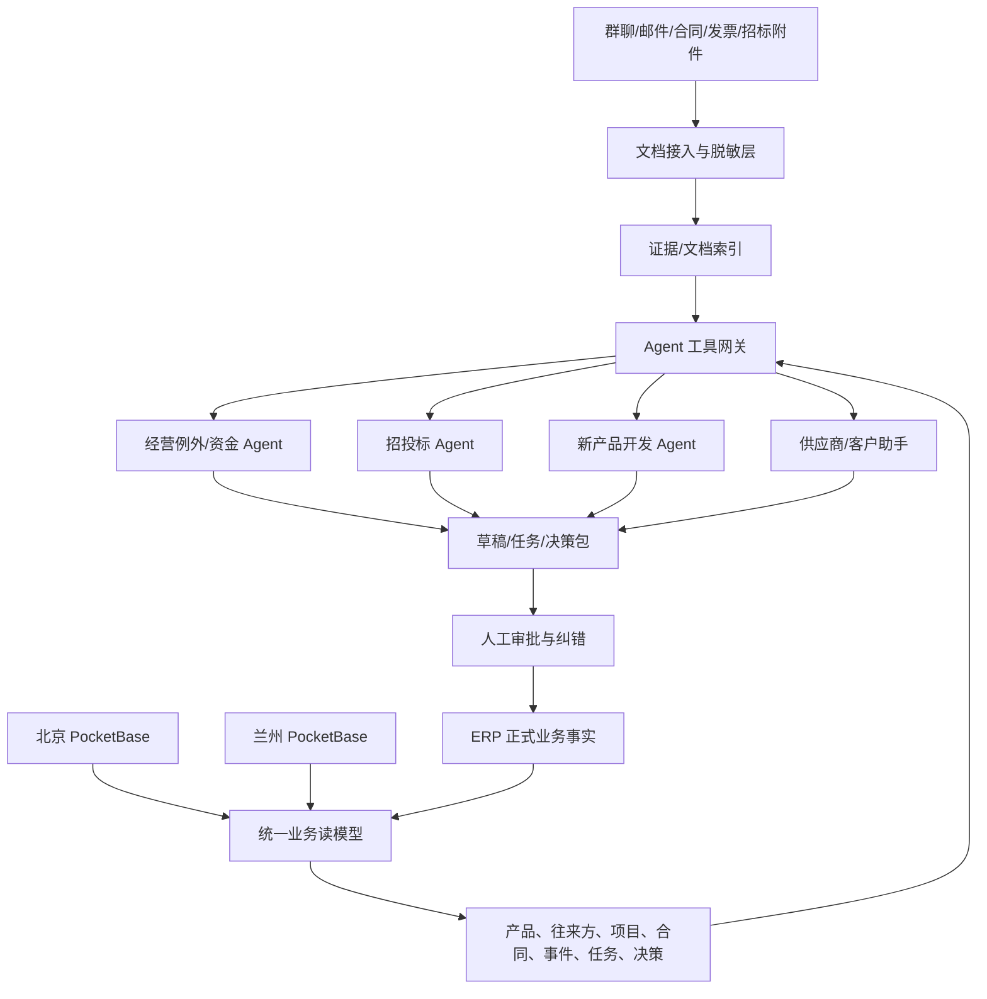

# 恒化成商贸 B2B 智能化推进分析

> 版本：2026-08-03
>
> 范围：群聊数据、北京/兰州 ERP 生产数据与代码、招投标 Agent、chemact 新产品寻源 Agent，以及企业 AI 落地的官方案例。
>
> 原则：本次只做了只读审计，没有修改生产数据。群聊分析只保留聚合结果，不在报告中复制个人身份证、手机号等敏感内容。

## 一、先说结论

公司已经跨过了“要不要做 AI”的阶段：ERP 中已有合同、履约、发票、收付款和投标数据，招投标 Agent 已在生产采集，chemact 也已建立证据化寻源的技术骨架。当前的主要矛盾不是“缺一个更强的大模型”，而是：

1. ERP 仍主要记录“已发生的单据”，尚未记录“商机如何被推进、人为什么做决策、下一步由谁在何时完成”。
2. 两地数据库、自由文本产品名、独立客户/供应商表和群聊工作流还没有形成统一的“业务对象 + 事件 + 决策”链。
3. 两个 Agent 都会“产出分析”，但人工确认、后续任务、转化结果和反馈数据还没有完整回流。
4. 业务信息大量存在于图片、语音、文件和对话上下文，不能靠“给 ERP 加一个聊天框”解决。

因此，推进方向应该是：

> **不再平行新建孤立 Agent，而是把 ERP 升级为“业务运营系统”；Agent 通过统一工具层读取事实、生成有证据的决策包、创建草稿与任务，人对高风险节点做确认。**

首批不建议上“全能企业知识问答”或自动报价/自动付款。应该先做三个闭环：

- **经营例外与资金闭环**：每天只告诉管理者哪些合同、到货、开票、收付款和毛利需要处理。
- **招投标闭环**：从“采集 630 条研判”升级到“人工反馈、负责人、截止期、投标草稿、输赢结果”全链路。
- **新产品开发闭环**：将 chemact 的供应商/客户/价格证据，转成有负责人、阶段、样品、测试、报价和下一步的开发项目。

## 二、现状诊断

### 2.1 群聊实际是公司的“隐形工作流系统”

审计的 12 个群、2026-05-05 至 2026-07-27 数据共有：

| 指标 | 结果 | 业务含义 |
|---|---:|---|
| 消息总数 | 3,875 | 已足以还原日常工作流 |
| 文本消息 | 1,736 | 可直接做结构化抽取 |
| 图片 | 734 | 信息大量依赖单据/截图 |
| 语音 | 521 | 需要转录和上下文归并 |
| 引用消息 | 399 | 说明任务与审批依赖上下文 |
| 其他/文件类 | 306 | 包含合同、凭证等材料 |
| 似合同/项目编号 | 162 个 | 可作为跨系统关联主键线索 |
| 出现在 2 个及以上群的编号 | 39 个 | 同一业务在多群间接力 |
| 出现在 3 个及以上群的编号 | 16 个 | 合同、付款、物流等状态被分散记录 |

文本中可直接识别的业务信号包括：审批/确认 408 条、申请/请求 283 条、数量 385 条、时效/截止 212 条、金额 129 条、合同/项目编号 170 条。图片、语音和文件类消息中有 604 条在 3 分钟内与同一发送人的文本相邻，说明“文本 + 附件”才是一个完整业务事件。

群聊已自然分成合同登记、付款、收款、出入库、运输与标签、公章、招投标、新产品开发和周报等队列。这不是单纯的知识检索问题，而是应将它们映射为 ERP 里的“事件、任务、状态变更、决策与证据”。

### 2.2 ERP 已有交易骨架，但主数据和状态尚不能直接作为 AI 事实

截至 2026-08-03，生产数据概况：

| 业务对象 | 北京 | 兰州 | 合计 |
|---|---:|---:|---:|
| 客户 | 8 | 41 | 49 |
| 供应商 | 6 | 25 | 31 |
| 销售合同 | 7 | 91 | 98 |
| 采购合同 | 10 | 106 | 116 |
| 销售发货 | 10 | 140 | 150 |
| 采购到货 | 9 | 98 | 107 |
| 销售发票 | 11 | 61 | 72 |
| 采购发票 | 21 | 99 | 120 |
| 销售收款 | 7 | 40 | 47 |
| 采购付款 | 9 | 103 | 112 |
| 投标记录 | 1 | 13 | 14 |

好的基础：

- 合同总额与单价 × 数量一致；绝大多数发货/到货/发票/收付款汇总与合同进度字段一致。
- 业务子单据均未发现失效的合同外键。
- 采购合同和多数履约/财务单据有附件，具备文档抽取条件。
- 系统已有经理确认、状态计算和超量防护 Hook，说明确定性规则已经开始从群聊进入系统。

阻碍 AI 直接利用的问题：

| 问题 | 审计证据 | 影响 |
|---|---|---|
| 北京/兰州双库分离 | 客户标准化后仅 2 家重合，供应商仅 1 家重合 | Agent 需要分别查两库，无全公司唯一主键 |
| 没有产品主数据 | `product_name` 在合同、履约、发票、收付款、投标和库存中重复保存 | 无法稳定按 CAS、别名、牌号、规格、应用聚合 |
| 子单据产品名漂移 | 北京 2 条、兰州 23 条子单据与父合同产品名不一致 | 同一订单可被 AI 误判为不同产品 |
| 供应商画像几乎为空 | 兰州 25/25 供应商电话、邮箱、地址、行业、区域均空；北京也基本为空 | 无法做供应商风险、地域运费、联系人与能力分析 |
| 客户细分不完整 | 兰州客户行业 17/41 空、区域 15/41 空；北京各 7/8 空 | 无法可靠做客群、交叉销售和新客开发匹配 |
| 销售合同文档不齐 | 兰州 91 份销售合同中仅 17 份有附件 | 合同条款、交付约束和风险不能完整追溯 |
| 历史 `pending` 污染 | 五类经理确认共 251 条 `pending`，243 条已超 7 天，164 条超 30 天 | 可能是迁移默认值与真实待审混合，不能直接当作审批队列或训练标签 |
| 销采链接冗余且单向 | 98 份销售合同的 `purchase_contract` 均为空，共有 54 份采购合同反向关联销售合同 | Agent 容易误读关系，应使用单一真源或关联表 |
| 投标历史结构不足 | 14 条历史投标的规格、纯度、包装、资格快照均空；13 条无来源公告链接 | 无法充分支撑 Agent 的资格核对与输赢复盘 |

`pending` 数量不应立即解释为真实积压，更可能是上线/迁移后未区分“历史无需审批”与“当前待审”。这正是数据治理应先于预测的典型例子。

### 2.3 招投标 Agent：采集与证据链已成型，现在需要做业务转化

当前北京库已有：

- 12 个招标源，10 个启用；
- 99 次采集运行，46 次成功、43 次无新增、10 次部分成功；
- 630 条公告，其中 476 条当前商机、154 条可关注商机；
- 630 条均有匹配产品、判断、要求、缺失信息、证据和结构化研判；
- 已能查北京/兰州历史投标并创建投标草稿。

这说明“发现→去重→读详情/附件→研判→追溯”已经具备生产形态。但 10 天左右出现 630 条研判，人工无法逐条处理。下一阶段的主要 KPI 不应再是“采到多少条”，而应是：

- 前 10/20 条中真正值得人工处理的比例；
- 有多少条被员工标记为无关、可做、待确认，以及标记原因；
- 多少条进入投标草稿、正式投标、中标/未中标；
- 是否真正减少了人工巡站和错过截止期。

现有 `agent_audit_logs` 生产记录为 0，也没有完整的人工复核/反馈对象。必须先补齐“人改了什么、为什么、后续结果是什么”，否则系统只会越积越多，不会越用越准。

### 2.4 chemact：证据化研究能力强，但尚未进入日常开发流程

chemact 已经完成产品信息、国内/国外寻源、搜索健康、证据归因、供应商角色判断、市场/客户/价格的结构化骨架。TDM 纵向切片已达到 Phase 3 技术出口，MEHQ 仍因客户/采购项目证据不足保持 `partial`。但完整可行性报告、本地历史索引、Electron 界面和 Windows 安装包尚未完成。

更关键的是，它目前的产物主要是 JSON/Markdown 报告，与 ERP 的客户、供应商、产品、商机、样品、报价和任务尚未形成关联。下一步不应先做更漂亮的报告，而应该将每条可执行结论转成：

`product_development_project -> lead/customer -> supplier_candidate -> sample/test -> quote -> next_action -> decision`

## 三、企业 AI 案例的可复用经验

下列只选用企业官网、官方客户案例或产品方官方案例。其中的收益数字多为企业/产品方自报，可用于理解方法，不应直接类推为本公司的 ROI 承诺。

| 案例 | 实际做法 | 对本公司的启示 |
|---|---|---|
| [Brenntag：先治理化工产品主数据](https://corporate.brenntag.com/en/media/news/brenntag-and-knowde-enter-into-a-strategic-partnership-to-master-product-data-with-ai.html) | 这家化学品分销商先用 AI 把非结构化产品信息变成统一、多维的 PIM 数据，标准化应用和属性，再支撑产品上架、销售、客户服务和供需计划。官方未披露 ROI。 | 这是与本公司业态最接近的案例。先建立 `product_id + CAS + 别名 + 牌号/规格 + 包装 + 应用 + 证明文档`，再让招投标、chemact、销采和客户开发共用；不应让每个 Agent 自建产品词库。 |
| [Synthomer：邮件/PDF 订单转 ERP 草稿](https://www.sap.com/italy/asset/dynamic/2026/06/26a59d25-567f-0010-bca6-c68f7e60039b.html) | 特种化学品供应商 Synthomer 从邮件和多页 PDF 抽取行级数据，结合物料目录、历史订单和客户信息解析产品、计量单位、客户和收货地址；员工修改/批准后才创建订单。Beta 测试披露首次物料匹配率 98%，尚不是独立审计的投产 ROI。 | 群聊/文件入口的正确产物是“字段级证据 + 可修改草稿 + 人工批准”，而不是 Agent 直接落正式单据。本公司的产品、计量单位和客户主数据是该场景的前置条件。 |
| [Dow：运费发票异常检查](https://www.microsoft.com/en/customers/story/19829-dow-microsoft-365-copilot) | Dow 让 Agent 对比运费费率、应计费用和发票费率，批量标出不一致；另一个 Agent 从邮件取 PDF 发票并路由异常。该公司预计首年运输环节可减少数百万美元成本，并从数百名员工试点扩展到约 20% 员工。 | 首个供应链 Agent 应聚焦“对账和例外”，而不是自动下单。本公司可从合同价格、运费、发票、到货数量和收付款的确定性核对做起。 |
| [BASF：按业务域做专用 AI](https://www.basf.com/global/en/careers/professionals/digitalization) | BASF 公开的组合包括 PlantGPT（工厂维修/排故/上岗知识）、QKnows（内部 R&D、科学文献和专利）、FOX（财务与控制的 KPI、规则和工具）。同时，[BASF 的负责任 AI 原则](https://www.basf.com/hr/hr/who-we-are/Digitalization/artificial-intelligence/Responsible-AI-at-BASF) 包括中央应用清单、风险评估、透明、人工监督、安全和隐私。 | 不要做一个“什么都管”的 Agent。用统一数据/工具层支撑资金例外、招投标、新产品和供应商等深场景；对所有 Agent 统一登记所有者、权限、风险级别和退出机制。 |
| [Bayer Crop Science：专家验证的行业知识系统](https://www.bayer.com/media/download/a0ac74dd-7a73-4071-9c9a-90a872aef69c/2024-0050e.pdf) | Bayer 将内部农艺专业知识和产品信息接入 GenAI，回答由农艺师验证；官方披露的试点优于当时市场上的通用大模型，并强调工具是增强专家而不是取代专家。 | chemact 与招投标研判应延续“闭源公司知识 + 外部证据 + 业务专家验证”。通用模型不应独立判断规格、制造商身份、资质或客户可做性。 |
| [Sanofi：跨部门 360° 决策平台](https://www.sanofi.com/en/media-room/press-releases/2023/2023-06-13-12-00-00-2687072) | Sanofi 的 plai 聚合跨部门内部数据，为数千个团队的决策者提供及时洞察和个性化“如果……会怎样”情景，范围从研发到制造供应和经营分析。 | 本公司的“管理者每日例外台”应建在跨北京/兰州的统一读模型上，输出可选情景与依据，而不是再做一个静态统计大屏。 |
| [Morgan Stanley：用评估集、人审和 CRM 回写推动采用](https://openai.com/index/morgan-stanley/) | 该公司对知识问答、摘要、翻译和会议行动项建立真实业务评估集与每日回归测试；会议摘要经顾问修改后才写入 CRM。官方披露理财顾问团队采用率超过 98%，文档可访问范围从 20% 升至 80%。 | “准确”不能靠主观演示。应将群聊、历史投标和产品评估数据做成固定评估集；Agent 输出只能先到草稿，人工修改必须回流。采用率来自质量与嵌入流程，不是靠强制推广。 |
| [中国中化：统一知识、智能体和能力治理](https://www.sinochem.com/sinochem/xwzx/zxdt/ywdt/2026/7/I1529521644316393472.html) | 中国中化建设“知识引擎-智能体引擎-AI 能力集市”三层解耦底座，对分散知识、能力复用和系统互通做统一管理。官方披露已支持超百家单位和超 4,000 个智能体；这是规模指标，未披露单场景 ROI。 | 本公司不应学“4,000 个 Agent”，应学共用能力：两个现有 Agent 从现在起共用身份权限、产品知识、工具注册、评估、审计和成本计量，并用清单淘汰低价值 Agent。 |

这些案例的共同点是：

1. 从明确的高成本工作流入手，不从“全员都能聊天”入手。
2. 将 AI 嵌入已有数据、邮件、CRM 和决策会议，不让它成为流程之外的新孤岛。
3. 业务专家、评估集、人工复核、权限与审计是生产系统的主体，不是上线后的附加项。
4. 先用一个灯塔场景证明业务价值，再将数据、工具、权限和评估复用给其他场景。

## 四、目标不是“多一个 Agent”，而是三条可学习的业务闭环

### 4.1 老客户与日常交易闭环

```text
客户/装置/产品需求
  -> 商机/询价/报价
  -> 销售合同
  -> 采购合同/备货
  -> 到货/发货
  -> 发票/收付款
  -> 毛利/资金占用/客诉
  -> 复购/交叉销售建议
```

AI 不直接替人改数据，而是识别异常，生成“决策包 + 下一步”，例如：某合同已到货但未发货、已开票但未回款、应收超过客户历史周期、汇率/运费导致实际毛利低于报价时。

### 4.2 招投标闭环

```text
巡检覆盖
  -> 候选公告
  -> 证据化研判
  -> 员工复核/纠错
  -> 责任人 + 截止时间
  -> 经理决策包
  -> 投标/报价草稿
  -> 开标结果/输赢原因
  -> 产品词库、资格库和评估集更新
```

现有系统已完成前 3 步和部分投标草稿，应把中间的人工决策和后面的业务结果补齐。

### 4.3 新产品/新客户开发闭环

```text
产品假设
  -> 产品身份/CAS/规格
  -> 国内外供应证据
  -> 目标装置/客户清单
  -> 业务人工复核
  -> 联系/样品/测试
  -> 报价/招投标
  -> 首单
  -> 标准产品与客户知识回流
```

当前 chemact 主要完成前 4 步；群聊和人工跟进承担后 4 步。智能化的价值是把二者接上，而不是让 Agent 重复写一份研究报告。

## 五、目标数据与 Agent 架构



### 5.1 不要先把所有 ERP 数据向量化

数字、日期、合同关系、金额、审批状态应使用结构化查询和确定性计算；合同条款、COA/MSDS、招标附件、沟通摘要才使用文档检索/RAG。最终的回答可同时引用：

- ERP 结构化事实及记录 ID；
- 原始附件页码/文本片段；
- 计算规则版本；
- Agent 版本和时间；
- 人工修改与最终决策。

### 5.2 建议补齐的核心对象

| 对象 | 核心字段/关系 | 解决什么 |
|---|---|---|
| `product_master` | 标准名、CAS、别名、牌号、规格、包装、危化属性、用途 | 统一合同、投标、chemact 和群聊中的产品身份 |
| `party` | 统一企业 ID、标准名/别名、客户/供应商/厂家角色、集团关系 | 避免同一企业重复建档，支持客户/供应商 360 |
| `opportunity` | 类型、产品、客户、来源、责任人、阶段、预计价值、下一步 | 承载老客商机、招投标和新产品开发 |
| `product_development_project` | 产品假设、目标装置/客户、可行性、阶段、样品/测试/报价 | 将 chemact 研究变成可管理的开发项目 |
| `business_event` | 对象、事件类型、时间、发起人、前后状态、证据 | 还原合同、物流、开票、收付款的时间线 |
| `task` | 任务类型、责任人、截止时间、状态、来源对象 | 取代群里“@ 某人确认”的不可追踪状态 |
| `decision_record` | 决策类型、输入快照、建议、人工结果、理由、模型/规则版本 | 建立 Agent 可评估、可追责、可学习的反馈数据 |
| `document/evidence` | 文档类型、业务对象、原文件、哈希、抽取结果、敏感级别、来源 | 让回答可回到原件，并支持脱敏与权限 |

第一阶段不需要重写 PocketBase ERP。可以在它之上增加标准表、只读聚合 API 和事件/任务表；再建一个跨北京/兰州的统一读模型。只有在数据量、并发或分析需求超出 PocketBase 能力时，再将读模型迁入 PostgreSQL/数仓，不必为了 AI 先做一次大迁移。

### 5.3 Agent 只通过受控工具访问业务

建议统一工具接口，例如：

- `get_customer_360(party_id)`
- `get_contract_health(contract_id)`
- `list_cash_exceptions(as_of, owner)`
- `search_product_evidence(product_id, query)`
- `create_task_draft(...)`
- `create_bid_draft(...)`
- `submit_for_human_approval(draft_id)`

不让每个 Agent 直接拿生产超级管理员令牌或自行理解底层表。所有写入都应有幂等键、草稿态、操作人、输入快照、工具调用日志和人工审批。

## 六、场景优先级

| 优先级 | 场景 | 业务价值 | 当前准备度 | 风险 | 建议 |
|---|---|---|---|---|---|
| P0 | 主数据、历史状态、权限与审计治理 | 是所有 Agent 的真实性基础 | 中 | 低 | 立即做，不作为“后台项目”延后 |
| P0 | 招投标人工反馈与转化闭环 | 减少巡站、提高有效商机率 | 高 | 中 | 现有 Agent 上直接补，暂停扩大采集面 |
| P0 | 管理者每日例外/决策台 | 将群里分散请示变成优先级队列 | 高 | 中 | 先规则、后 LLM 摘要；只读/草稿起步 |
| P0 | 应收/应付与资金异常助手 | 减少资金占用和遗漏 | 高 | 高 | 先清理 `pending`、定义账龄与实现规则；不自动付款 |
| P1 | 群聊/文件→ERP 业务草稿 | 减少重复登记，保留证据 | 中 | 高 | 先做人工粘贴/上传入口，不直连个人微信 |
| P1 | chemact →产品开发项目 | 将研究转成样品、客户、报价和首单 | 中高 | 中 | 先做 TDM 一个端到端样板，再复制 |
| P1 | 供应商 360 与询价比较 | 缩短寻源，复用历史价格/交期/质量 | 中 | 中 | 先补供应商主数据和报价对象 |
| P2 | 客户交叉销售/复购建议 | 提升老客产品渗透 | 低中 | 中 | 有完整客户-装置-产品数据后再做 |
| P2 | 价格/中标/回款预测 | 辅助报价与现金流 | 低 | 高 | 样本和时间序列不足，现阶段只做规则和情景测算 |

## 七、12 个月推进路线图

### 阶段 0：0-30 天，建立可信基线

交付：

1. 由总经理指定 1 名内部 AI 产品负责人，销售、采购、财务各指定 1 名流程负责人。
2. 设立产品主数据 v1，将现有 74+ 个原始产品名映射到标准产品，增加 CAS/别名/规格。
3. 设立往来方统一 ID 与北京/兰州对照表，不要立即物理合并数据库。
4. 区分历史迁移 `pending`、当前真实待审、已审不可考三类状态，为队列建立基准时间。
5. 定义 `business_event`、`task`、`decision_record`、`document/evidence` 最小模型。
6. 完成数据分级、角色权限和密钥治理，为 Agent 分配独立服务身份。
7. 建立基线：人工每日巡站时间、每份合同重复登记时间、决策等待时间、逾期应收、报价周期、商机转化。

出口门槛：产品标准映射覆盖所有在执行合同；真实待审队列可信；Agent 不使用共享超级管理员凭据。

### 阶段 1：31-90 天，两个灯塔闭环

**闭环 A：管理者每日例外台**

- 规则检测：临近发货/到货、已到货未开票、已开票未回款、超账龄、超合同数量、资料缺失、利润异常。
- LLM 只负责将多条事实整理成决策包，不计算金额，不自动审批。
- 管理者可确认、驳回、指定负责人、设截止期，结果写入 `decision_record/task`。

**闭环 B：招投标反馈与转化**

- 对每条高优先级公告增加负责人、复核结果、复核原因、下一步、截止期和任务。
- 建立“未查到、无相关、有关但不做、进入报价、正式投标、中标/未中标”漏斗。
- 每周复盘 Top-K 准确率、漏报、人工修改率和从发现到决策的时长。
- 开始写入 `agent_audit_logs`，但日志不存超级管理员令牌、模型密钥和完整敏感文档。

建议验收目标（在第 0 阶段基线上确认数值）：

- 管理者每日在一个页面完成当天主要决策；
- 高优先级公告 100% 有负责人/截止期/处理状态；
- 引用的金额、日期、规格和资格条款 100% 可回到 ERP 记录或原始附件；
- 所有 Agent 写入为草稿/任务，无未经授权的付款、报价和正式合同修改。

### 阶段 2：3-6 个月，打通产品开发与文档入口

1. 用 TDM 建立第一个 `product_development_project`，将 chemact 供应商/客户/价格证据导入 ERP 草稿。
2. 建立产品开发看板：待研究、待业务复核、待联系、样品中、测试中、报价中、赢单、暂停/放弃。
3. 新增供应商候选、询价、样品、测试、客户反馈对象。
4. 建立 ERP 上传/粘贴入口：对群聊文本、图片、语音、合同、发票做转录/OCR/抽取，生成草稿；字段级显示来源和置信度。
5. 建立供应商 360：历史价格、实际交期、质量/客诉、资质、可供规格和联系记录。

出口门槛：至少 1 个新产品从研究证据走到真实客户/供应商行动；每条 Agent 候选均能看到人工复核和业务后果。

### 阶段 3：6-12 个月，在数据足够后做预测和策略优化

只有当前述闭环稳定运行、人工反馈和时间序列数据足够时，再逐步试点：

- 客户复购/交叉销售提醒；
- 商机与招标排序优化；
- 回款时间情景预测；
- 报价毛利/费用/汇率情景测算；
- 供应商交期与履约风险评分。

这一阶段仍应使用可解释特征、时间切分验证和人工决策，不应因为模型给出一个分数就自动改价或改信用政策。

## 八、组织与治理

不建议为当前规模建设独立“AI 中心”，建议建立小型跨部门产品组：

| 角色 | 责任 |
|---|---|
| 总经理/业务负责人 | 定优先级和风险边界，只评审业务结果，不评审“模型看起来多聪明” |
| AI 产品负责人 | 管理统一场景待办、业务验收、采用率、问题复盘和路线图 |
| 销售/采购/财务流程负责人 | 定义状态、异常、证据和最终决策，每周复核 Agent 错例 |
| 数据负责人 | 产品/往来方标准、字段完整率、历史迁移标识和数据修复 |
| 工程负责人 | 工具接口、权限、日志、评估、部署和故障降级 |

建议节奏：每周 30 分钟复盘错例/人工修改/业务结果；每两周排一次产品待办；每月由管理层只做三个决定：继续、收缩或停止某场景。

## 九、评估体系

不用“生成了多少段文字”评价 AI，而用下列四层指标：

| 层级 | 指标示例 |
|---|---|
| 业务结果 | 巡站工时、错过截止数、报价周期、商机转化率、中标率、逾期应收、资金占用、毛利偏差、新产品首单周期 |
| 流程采用 | 有负责人/下一步的商机比例，通过 ERP 完成的复核比例，人工重复登记时间，每周活跃处理人数 |
| Agent 质量 | Top-K 准确率、关键漏报率、人工修改率、建议采用率、证据覆盖率、工具成功率、单个成功任务成本 |
| 数据健康 | 标准产品映射率、往来方去重率、关系完整率、文档抽取成功率、状态超期率、审计日志完整率 |

每个场景上线前必须有固定评估集和影子模式。对资金、合同、报价、投标资格等高风险场景，除平均准确率外，必须单独监控高危错误。

## 十、必须立即处理的安全边界

本次审计发现：

1. 项目工作区存在明文生产管理员登录凭据，以及被 Git 忽略但仍位于项目目录的 SSH 私钥材料。
2. 生产业务表当前规则是“所有已登录用户均可读、新增、更新和删除”，没有按销售、采购、财务、管理者和 Agent 服务做最小权限拆分。
3. 群聊中包含司机身份证、手机号、车牌、银行/付款与商业信息，不能不分级地整批发给外部模型。

在为 Agent 增加写入能力前，应立即旋转已暴露的密码/秘钥，将凭据放到密钥管理或受控环境变量，实施 RBAC/服务身份，并为证件号、手机、银行账户、合同金额设置字段/文档级访问和模型出域策略。

## 十一、未来 30 天的具体开工清单

1. 召开 90 分钟业务会，只确认三件事：两个灯塔闭环、每个闭环的负责人、当前基线指标。
2. 停止新增独立 Agent 项目，将开发待办收口到统一产品路线图。
3. 清洗 251 条历史 `pending`，并定义真实待审 SLA。
4. 创建 `product_master` 和原始产品名映射表；不立即批量改写历史文本。
5. 建立北京/兰州统一往来方对照，优先处理在执行合同。
6. 给招投标页增加人工复核、原因、负责人、下一步和截止时间，开始收集反馈数据。
7. 定义经营例外的第一版确定性规则，暂不让 LLM 作金额计算。
8. 为 TDM 创建一个真实产品开发项目，由业务人确认 chemact Top 5 供应商/客户线索。
9. 旋转现有生产凭据，完成第一版 RBAC 权限矩阵和 Agent 专用服务身份。
10. 建立第一份每周 AI 业务评分卡，只看业务结果、人工修改、证据和故障，不看生成文字数量。

## 十二、应避免的五个常见失败模式

1. **平台先行**：先买大而全的“企业 AI 平台”，再找场景。应改为两个有基线的灯塔闭环驱动共性能力。
2. **问答先行**：先把所有文档放进向量库做聊天。这可以演示，却很难形成收款、中标和首单。
3. **报告终点**：Agent 产出 PDF/Markdown 后就算完成。报告必须转成对象、任务和可追踪决策。
4. **全自动执行**：太早让 Agent 发报价、审付款或改合同。应按“只读→草稿→人审→限定自动”逐级放权。
5. **没有停止条件**：只累加功能，不看采用和业务结果。每个场景应有 6-8 周验收门槛，不达标就收缩或停止。

## 附录 A：本地依据

- `企业AI案例一手研究-2026.md`：10 个化工、分销、招采和企业 Agent 一手/高可信案例的详细整理。
- `../PRODUCT.md`：当前招投标产品原则。
- `../CONTEXT.md`：招投标统一语言和证据边界。
- `local-agent-phase2-intelligence-plan.md`、`local-agent-architecture.md`：招投标本地助手方案。
- `../../chemact/docs/implementation-roadmap.md`：chemact 当前阶段和未完成项。
- `../../chemact/docs/chem-act.md`：新产品寻源业务边界。
- `../../ 群数据/texts/*.json`：12 个群的聚合流程分析。

## 附录 B：数据审计口径

- 生产数据通过 PocketBase 管理 API 只读获取集合 schema、记录数、空值、关系完整性和汇总一致性；报告不保存客户、供应商、个人的明细。
- 产品名“不一致”使用去空格/常见标点与全角归一后的值比较，不代表化学语义上必然不同，但足以表明自由文本在漂移。
- 历史 `pending` 的时长按记录创建时间粗略计算；在作为运营队列前必须由业务确认迁移口径。
