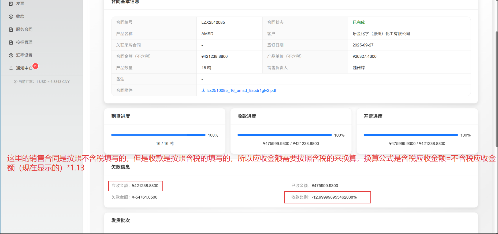
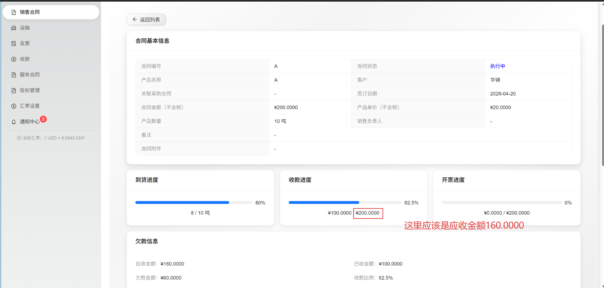

# 六、update6 — 数值精度、含税收款、跳转按钮、收款进度修复

> 创建日期：2026-04-20
> 状态：执行中

## 6.1 需求总览

| # | 需求 | 涉及页面/模块 | 角色 |
|---|------|--------------|------|
| 1 | 全局数值精度统一为6位小数（百分比保留2位） | 所有显示金额/单价/数量的页面 | 全局 |
| 2 | 销售收款支持含税/不含税选择 | `sale_receipts` 后端 + 收款表单/详情/合同详情 | 销售 |
| 3 | 子信息详情页添加「查看关联合同」跳转按钮 | 运输/收付款/开收票的详情页（销售+采购） | 销售+采购 |
| 4 | 销售合同收款进度分母改为应收金额 | `sales/contracts/ContractDetail.tsx` | 销售 |

---

## 6.2 问题1 — 全局数值精度统一为6位小数

### 6.2.1 规则定义

| 数值类型 | 显示精度 | 示例 |
|---------|---------|------|
| 金额（合同金额、收款金额、付款金额、发票金额、运费、杂费等） | 6位小数 | `¥421238.880000` |
| 单价（产品单价、含税单价、不含税单价） | 6位小数 | `¥26327.430000` |
| 数量（产品数量、执行数量、到货数量、发货数量） | 6位小数 | `16.000000 吨` |
| 比例/进度（百分比） | 2位小数 | `62.50%` |
| 汇率 | 6位小数 | `6.834300` |

### 6.2.2 修改范围

全局搜索所有 `.toFixed(2)`、`.toFixed(4)` 调用，判断其用途：
- 如果是金额、单价、数量类数值 → 改为 `.toFixed(6)`
- 如果是百分比、比例 → 保持 `.toFixed(2)`

**关键文件（预计）**：
- `frontend/src/pages/sales/contracts/ContractList.tsx`
- `frontend/src/pages/sales/contracts/ContractDetail.tsx`
- `frontend/src/pages/sales/shipments/*.tsx`
- `frontend/src/pages/sales/receipts/*.tsx`
- `frontend/src/pages/sales/invoices/*.tsx`
- `frontend/src/pages/purchase/contracts/ContractList.tsx`
- `frontend/src/pages/purchase/contracts/ContractDetail.tsx`
- `frontend/src/pages/purchase/arrivals/*.tsx`
- `frontend/src/pages/purchase/payments/*.tsx`
- `frontend/src/pages/purchase/invoices/*.tsx`
- `frontend/src/pages/manager/ContractDetailPage.tsx`
- `frontend/src/pages/manager/OverviewPage.tsx`

---

## 6.3 问题2 — 销售收款支持含税/不含税选择

### 6.3.1 业务逻辑

当销售合同按**不含税**填写时（`is_tax_included = false`），收款记录允许销售员选择按**含税**还是**不含税**来收款：

- 若收款 `is_tax_included = false`（默认）：应收金额 = 合同金额（不含税）
- 若收款 `is_tax_included = true`：应收金额 = 合同金额 × 1.13

> 增值税率按 13% 计算，即含税金额 = 不含税金额 × 1.13

### 6.3.2 后端字段

在 `sale_receipts` 集合新增字段：

| 字段名 | 类型 | 默认值 | 说明 |
|--------|------|--------|------|
| `is_tax_included` | Bool | `false` | 该笔收款是否按含税计算 |

### 6.3.3 前端修改

**收款表单（`ReceiptForm.tsx`）**：
- 添加 Switch 开关「按含税收款」
- 仅当关联销售合同 `is_tax_included = false` 时显示此开关
- 提交时包含 `is_tax_included` 字段

**收款详情（`ReceiptDetail.tsx`）**：
- 显示「计税方式」：含税 / 不含税

**销售合同详情（`ContractDetail.tsx`）**：
- 应收金额计算逻辑调整：
  - 如果合同本身含税：`应收金额 = 合同金额`
  - 如果合同不含税且存在按含税收款的记录：`应收金额 = 合同金额 × 1.13`
  - 如果合同不含税且所有收款都不含税：`应收金额 = 合同金额`
- 实际上，应收金额应该是根据具体收款记录的 `is_tax_included` 来分别计算
- 更简单的逻辑：在显示每笔收款时，如果 `is_tax_included = true`，显示含税金额

**欠款信息区域**：
- 应收金额 = 合同金额（不含税时）或 合同金额 × 1.13（含税时）
- 需要根据实际收款记录的 `is_tax_included` 汇总计算

### 6.3.4 参考图片



---

## 6.4 问题3 — 子信息详情页添加「查看关联合同」跳转按钮

### 6.4.1 修改范围

将以下详情页中的「关联合同信息」表格/卡片移除，替换为「查看关联合同」按钮：

**销售模块**：
| 页面 | 当前显示 | 修改后 |
|------|---------|--------|
| `sales/shipments/ShipmentDetail.tsx` | 关联销售合同信息表 | 「查看关联销售合同」按钮 |
| `sales/receipts/ReceiptDetail.tsx` | 关联销售合同信息表 | 「查看关联销售合同」按钮 |
| `sales/invoices/InvoiceDetail.tsx` | 关联销售合同信息表 | 「查看关联销售合同」按钮 |

**采购模块**：
| 页面 | 当前显示 | 修改后 |
|------|---------|--------|
| `purchase/arrivals/ArrivalDetail.tsx` | 关联采购合同信息表 | 「查看关联采购合同」按钮 |
| `purchase/payments/PaymentDetail.tsx` | 关联采购合同信息表 | 「查看关联采购合同」按钮 |
| `purchase/invoices/InvoiceDetail.tsx` | 关联采购合同信息表 | 「查看关联采购合同」按钮 |

### 6.4.2 按钮行为

- 点击按钮 → `navigate(`/sales/contracts/${sales_contract_id}`)` 或 `navigate(`/purchase/contracts/${purchase_contract_id}`)`
- 按钮样式：Primary Button，带 `LinkOutlined` 图标

---

## 6.5 问题4 — 销售合同收款进度分母改为应收金额

### 6.5.1 问题描述

当前收款进度条显示：`已收金额 / 合同金额`

**正确逻辑**：`已收金额 / 应收金额`

其中应收金额 = 合同金额（含税时）或 合同金额 × 1.13（不含税但按含税收款时）

### 6.5.2 参考图片



图中：
- 合同金额 = ¥200.0000
- 应收金额 = ¥160.0000（可能是折扣或部分执行后的应收）
- 已收金额 = ¥100.0000
- 当前进度显示：`¥100.0000 / ¥200.0000`（50%）
- **应该显示**：`¥100.0000 / ¥160.0000`（62.5%）

### 6.5.3 修改文件

- `frontend/src/pages/sales/contracts/ContractDetail.tsx`
- 收款进度组件的分母从 `contract.total_amount` 改为 `contract.receivable_amount`

---

## 6.6 修改文件清单（预计）

### 后端
| # | 操作 | 说明 |
|---|------|------|
| 1 | PocketBase `sale_receipts` 新增 `is_tax_included` bool 字段 | 北京 + 兰州 |

### 前端 — 数值精度
| # | 文件 | 操作 |
|---|------|------|
| 1 | `frontend/src/pages/sales/contracts/ContractList.tsx` | 金额/单价精度改为6位 |
| 2 | `frontend/src/pages/sales/contracts/ContractDetail.tsx` | 金额/单价/数量精度改为6位，进度百分比保持2位 |
| 3 | `frontend/src/pages/sales/shipments/*.tsx` | 金额/数量精度改为6位 |
| 4 | `frontend/src/pages/sales/receipts/*.tsx` | 金额精度改为6位 |
| 5 | `frontend/src/pages/sales/invoices/*.tsx` | 金额精度改为6位 |
| 6 | `frontend/src/pages/purchase/contracts/ContractList.tsx` | 金额/单价精度改为6位 |
| 7 | `frontend/src/pages/purchase/contracts/ContractDetail.tsx` | 金额/单价/数量精度改为6位 |
| 8 | `frontend/src/pages/purchase/arrivals/*.tsx` | 金额/数量精度改为6位 |
| 9 | `frontend/src/pages/purchase/payments/*.tsx` | 金额精度改为6位 |
| 10 | `frontend/src/pages/purchase/invoices/*.tsx` | 金额精度改为6位 |
| 11 | `frontend/src/pages/manager/ContractDetailPage.tsx` | 金额/单价/数量精度改为6位 |
| 12 | `frontend/src/pages/manager/OverviewPage.tsx` | 金额精度改为6位 |

### 前端 — 含税收款
| # | 文件 | 操作 |
|---|------|------|
| 13 | `frontend/src/types/sale-receipt.ts` | 新增 `is_tax_included?: boolean` |
| 14 | `frontend/src/api/sale-receipt.ts` | 提交 `is_tax_included` |
| 15 | `frontend/src/pages/sales/receipts/ReceiptForm.tsx` | 添加「按含税收款」Switch |
| 16 | `frontend/src/pages/sales/receipts/ReceiptDetail.tsx` | 显示计税方式 |
| 17 | `frontend/src/pages/sales/contracts/ContractDetail.tsx` | 应收金额/收款进度逻辑调整 |

### 前端 — 跳转按钮
| # | 文件 | 操作 |
|---|------|------|
| 18 | `frontend/src/pages/sales/shipments/ShipmentDetail.tsx` | 移除合同信息表，添加跳转按钮 |
| 19 | `frontend/src/pages/sales/receipts/ReceiptDetail.tsx` | 移除合同信息表，添加跳转按钮 |
| 20 | `frontend/src/pages/sales/invoices/InvoiceDetail.tsx` | 移除合同信息表，添加跳转按钮 |
| 21 | `frontend/src/pages/purchase/arrivals/ArrivalDetail.tsx` | 移除合同信息表，添加跳转按钮 |
| 22 | `frontend/src/pages/purchase/payments/PaymentDetail.tsx` | 移除合同信息表，添加跳转按钮 |
| 23 | `frontend/src/pages/purchase/invoices/InvoiceDetail.tsx` | 移除合同信息表，添加跳转按钮 |

---

## 6.7 实施顺序

```
1. PocketBase 后台添加 sale_receipts.is_tax_included bool 字段（北京+兰州）
2. 修改 types/sale-receipt.ts 新增 is_tax_included 字段
3. 修改 api/sale-receipt.ts 提交 is_tax_included
4. 修改 ReceiptForm.tsx 添加含税开关
5. 修改 ReceiptDetail.tsx 显示计税方式
6. 修改 sales/contracts/ContractDetail.tsx — 收款进度/应收金额逻辑
7. 全局修改所有 .toFixed(2) → .toFixed(6)（排除百分比）
8. 修改6个子信息详情页，移除合同信息表，添加跳转按钮
9. TypeScript 编译检查
10. 构建 + 部署
```

## 6.8 验证方法

1. **数值精度**：销售/采购合同列表/详情 → 金额显示 `¥123456.789000`
2. **含税收款**：创建不含税销售合同 → 添加收款记录 → 选择「按含税收款」→ 应收金额自动 ×1.13
3. **跳转按钮**：打开任意到货/发货/收款/付款/发票详情 → 点击「查看关联合同」→ 正确跳转到合同详情
4. **收款进度**：合同详情页 → 收款进度分母显示为应收金额（而非合同金额）
